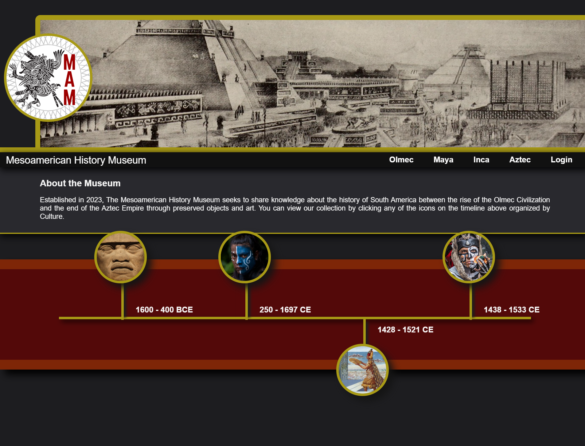
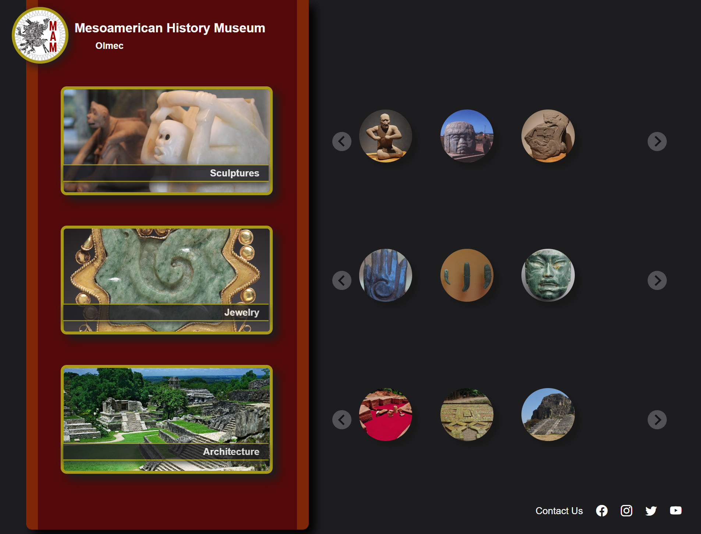
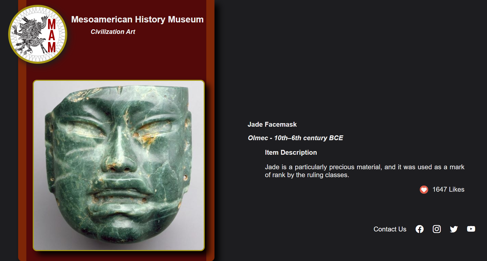
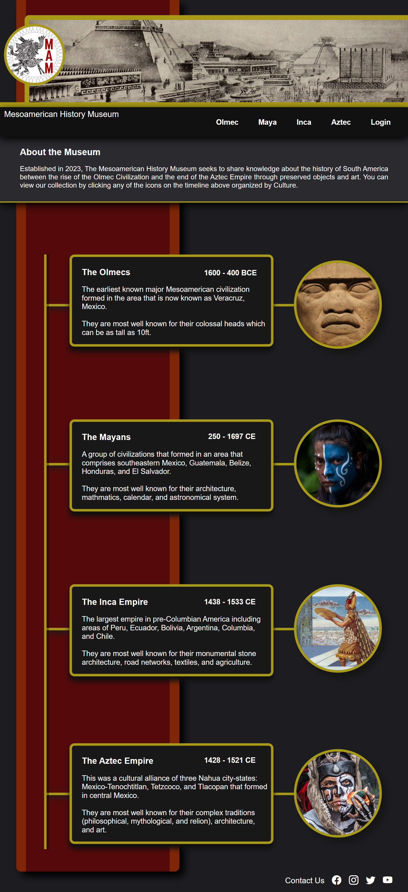
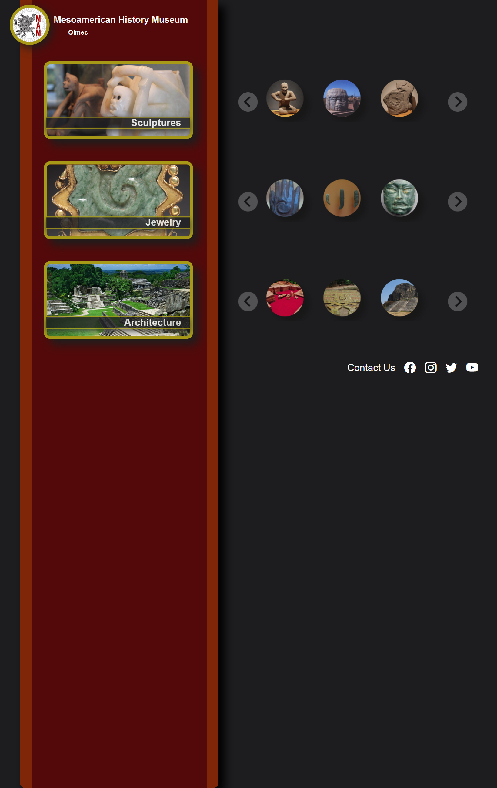
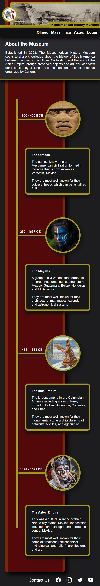
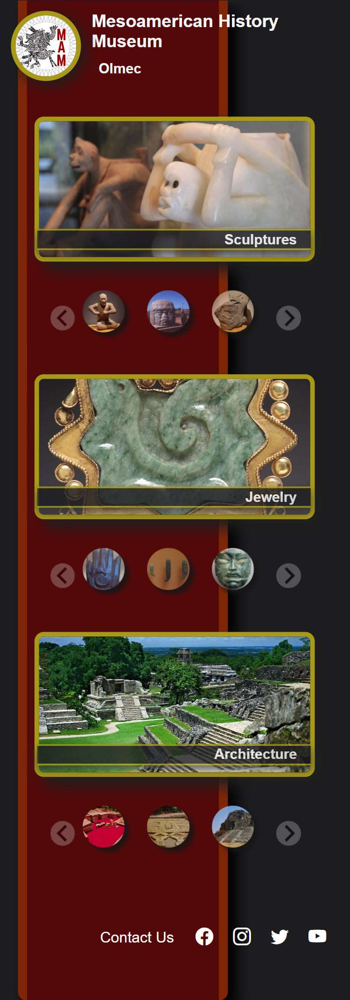
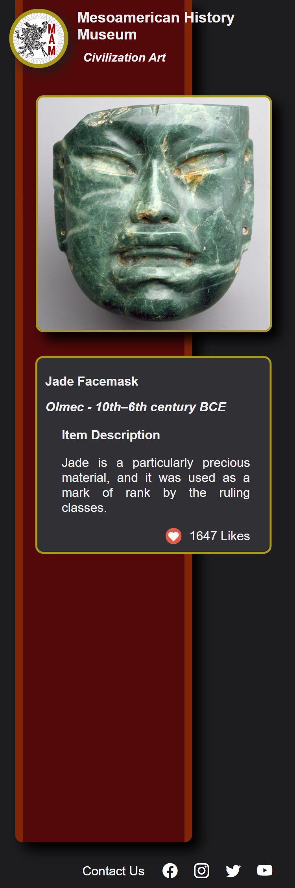

# Mesoamerican-Museum

## Description

Visitors to the Mesoamerican Museum can view the museum collection images with descriptive information about the artifacts.

Employees to the Mesoamerican Museum can manage the museum collection by adding, updating, or removing items from the museum collection.

### User Story

```
AS AN employee at a Mesoamerican Museum
I WANT a website with a secure login where I can add, update, or remove artifacts from the museum collection
SO THAT the museum can maintain and organize its collection of artifacts
AS A visitor to the museum
I WANT a website where I can view the museum collection artifacts and the associated known information about the artifacts
```

### Acceptance Criteria

```
GIVEN a functional CRUD (create, read, update and delete) application
WHEN I visit the homepage
THEN I can securely login to add, update, or remove artifacts from the database
WHEN I visit the homepage
THEN I can view artifacts by civilization
WHEN I select a civilization
THEN I can view the specific artifact from the selected civilization
```

## Table of Contents

- [Installation](#installation)
- [Usage](#usage)
- [Credits](#credits)
- [License](#license)

## Installation

A step-by-step description of how to get the development environment running.

Install the database by running the following command in the mysql terminal

```
SOURCE: schema.sql
```

Run the seed file with the following command to seed the database

```
npm run seed
```

Use the following command to install the necessary packages

```
npm install (package_name@version)
```

This application uses the following:

[Bcrypt](https://www.npmjs.com/package/bcrypt) as a library to help you hash passwords.

[Cloudinary](https://cloudinary.com/documentation/upload_widget) an image uploading tool, the linked widget here will handle the image uploading and hosting, and it will return a hosted url link for you to save in your database.

[Connect Session Sequelize](https://www.npmjs.com/package/connect-session-sequelize) session store for connect-session using sequelize.

[Dotenv](https://www.npmjs.com/package/dotenv) to load environment variables from a .env file.

[Express](https://www.npmjs.com/package/express/v/4.16.4) as a node js web application framework.

[Express Handlebars](https://www.npmjs.com/package/express-handlebars) compiles templates into JavaScript functions.

[Express Session](https://www.npmjs.com/package/express-session) is a simple session middleware for Express. Session data is not saved in the cookie itself, just the session ID. Session data is stored server-side.

[MySQL2](https://www.npmjs.com/package/mysql2) to connect to your MySQL database.

[Sequelize](https://sequelize.org/docs/v6/) as a promise-based Node.js ORM tool for MySQL.


## Usage

To maintain a museum collection of artifacts in a database using a CRUD (create, read, update and delete) application. To view artifacts organized by civilization.

### Deployed Site
https://mysterious-stream-999999.herokuapp.com/

### ERD


### Wireframe


### Screenshot Desktop View





### Screenshot Tablet View




### Screenshot Mobile View





## Credits

Collaborators: Abi Kumagai, Taylor Orsini, Lydia Rodriguez, and Ian Danas

Tutor: Doug Kumagai:
<br />
https://www.linkedin.com/in/doug-kumagai/
<br />
https://github.com/ndesmic
<br />

mdn web docs: https://developer.mozilla.org/en-US/

Markdown License badges: https://gist.github.com/lukas-h/2a5d00690736b4c3a7ba

shields.io: https://shields.io/

Insomnia: https://insomnia.rest/

Bcrypt: https://www.npmjs.com/package/bcrypt

Cloudinary Upload Widget: https://cloudinary.com/documentation/upload_widget
<br />
- an image uploading tool, the linked widget here will handle the image uploading and hosting, and it will return a hosted url link for you to save in your database

Connect Session Sequelize: https://www.npmjs.com/package/connect-session-sequelize

dotenv: https://www.npmjs.com/package/dotenv

Express: https://www.npmjs.com/package/express/v/4.16.4

Express Handlebars: https://www.npmjs.com/package/express-handlebars

Express Session: https://www.npmjs.com/package/express-session

MySQL2: https://www.npmjs.com/package/mysql2

Sequelize: https://sequelize.org/docs/v6/

Splide: https://splidejs.com/
<br />
- slider/carousel written in TypeScript

Splide Getting Started: https://splidejs.com/guides/getting-started/

Splide Image Carousel: https://splidejs.com/tutorials/image-carousel/

Getting Started with Cloudinary: https://console.cloudinary.com/console/c-5f93c188309708e5da132ef338c9d4/getting-started

How To Integrate Cloudinary: https://cloudinary.com/documentation/how_to_integrate_cloudinary

Cloudinary node integration: https://cloudinary.com/documentation/node_integration

Cloudinary upload presets: https://cloudinary.com/documentation/upload_presets

Introduction to Cloudinary for Node.js Developers: https://training.cloudinary.com/learn/course/introduction-for-api-users-developers/before-the-lessons/what-to-expect

cloudinary-training GitHub: https://github.com/cloudinary-training/cld-intro-nodejs

Cloudinary cld-intro-nodejs/manage.js: https://github.com/cloudinary-training/cld-intro-nodejs/blob/main/manage.js

Handlebars: https://handlebarsjs.com/

A Step By Step Guide To Using Handlebars With Your Node js App: https://waelyasmina.medium.com/a-guide-into-using-handlebars-with-your-express-js-application-22b944443b65

Express Session Cookie: https://github.com/expressjs/session#cookie

Bootstrap: https://getbootstrap.com/
<br />
- social media icons

Canva: https://www.canva.com/
<br />
- Canva is a free-to-use online graphic design tool

Favicon I/O: https://favicon.io/
<br />
- favicon generator / converter

Image Online: https://crop-circle.imageonline.co/
<br />
- crop a circle in image online

Wikimedia: https://commons.wikimedia.org/wiki/Main_Page
<br />
- images

Open Access at the National Gallery of Art: https://www.nga.gov/open-access-images.html
<br />
- images

Getty Museum Collection: https://www.getty.edu/art/collection/
<br />
- images

Museum of Indian Arts + Culture: https://www.indianartsandculture.org/collections
<br />
- reference material

National Museum of the American Indian: https://americanindian.si.edu/
<br />
- reference material

"The Art of MesoAmerica" Thames & Hudson world of art, sixth edition, Author: Mary Ellen Miller
<br />
- reference material


## License

Please refer to the LICENSE in the repo.

---

## Badges

[](https://opensource.org/licenses/MIT)

## Features

Image carousel for museum visitor to view museum collection items. Cloudinary upload widget for museum employees to upload images of artifacts.

