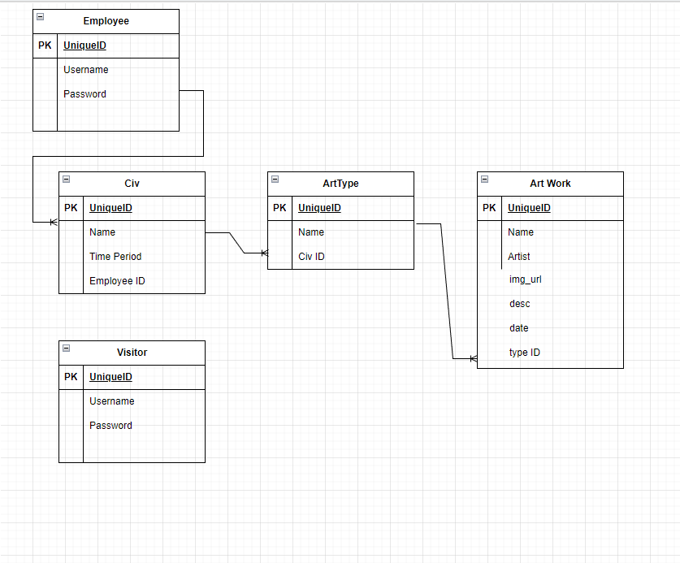
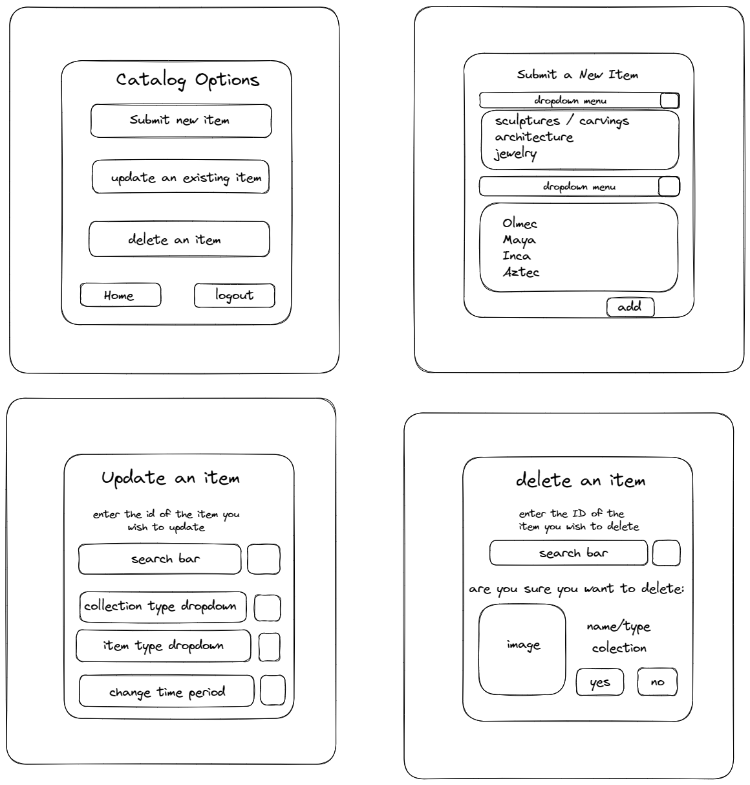
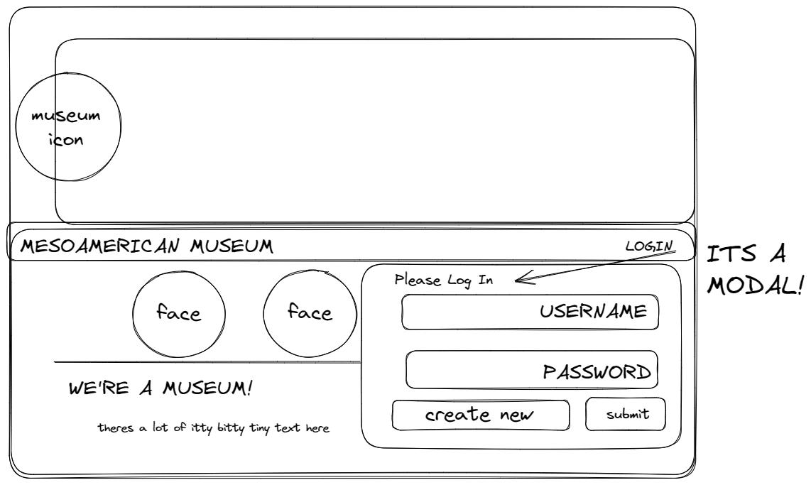

# Mesoamerican-Museum

## Description

Provide a short description explaining the what, why, and how of your project. Use the following questions as a guide:

- What was your motivation?
- Why did you build this project? (Note: the answer is not "Because it was a homework assignment.")
- What problem does it solve?
- What did you learn?

### User Story

```
AS AN employee at a mesoamerican museum
I WANT a website with a secure login where I can add, update, or remove artifacts from the museum collection
SO THAT the museum can maintain and organize its collection of artifacts
AS A visitor to the museum
I WANT a website where I can view the museum collection artifacts and the associated known information about the artifacts
```

### Acceptance Criteria

```
GIVEN a functional CRUD (create, read, update and delete) application
WHEN I visit the homepage
THEN I can securely login to add, update, or remove artifacts from the database
WHEN I visit the homepage
THEN I can view artifacts by civilization
WHEN I select a civilization
THEN I can view the specific artifact from the selected civilization
```

## Table of Contents

- [Installation](#installation)
- [Usage](#usage)
- [Credits](#credits)
- [License](#license)

## Installation

A step-by-step description of how to get the development environment running.

Install the database by running the following command in the mysql terminal

```
SOURCE: schema.sql
```

Use the following command to install the necessary packages

```
npm install (package_name@version)
```

This application uses the following:

[Bcrypt](https://www.npmjs.com/package/bcrypt) as a library to help you hash passwords.

[Cloudinary](https://cloudinary.com/documentation/upload_widget) an image uploading tool, the linked widget here will handle the image uploading and hosting, and it will return a hosted url link for you to save in your database.

[Connect Session Sequelize](https://www.npmjs.com/package/connect-session-sequelize) session store for connect-session using sequelize.

[Dotenv](https://www.npmjs.com/package/dotenv) to load environment variables from a .env file.

[Express](https://www.npmjs.com/package/express/v/4.16.4) as a node js web application framework.

[Express Handlebars](https://www.npmjs.com/package/express-handlebars) compiles templates into JavaScript functions.

[Express Session](https://www.npmjs.com/package/express-session) is a simple session middleware for Express. Session data is not saved in the cookie itself, just the session ID. Session data is stored server-side.

[MySQL2](https://www.npmjs.com/package/mysql2) to connect to your MySQL database.

[Sequelize](https://sequelize.org/docs/v6/) as a promise-based Node.js ORM tool for MySQL.

[UUID](https://www.npmjs.com/package/uuid) for generating an Universal Unique Identifier.


## Usage

To maintain a museum collection of artifacts in a database using a CRUD (create, read, update and delete) application. To view artifacts organized by civilization.

### Deployed Site


### ERD



### Wireframe







### Screenshot Desktop View


### Screenshot Tablet View


### Screenshot Mobile View


## Credits

Collaborators: Abi Kumagai, Taylor Orsini, Lydia Rodriguez, and Ian Danas

Tutor: Doug Kumagai:
<br />
https://www.linkedin.com/in/doug-kumagai/
<br />
https://github.com/ndesmic
<br />

mdn web docs: https://developer.mozilla.org/en-US/

Markdown License badges: https://gist.github.com/lukas-h/2a5d00690736b4c3a7ba

shields.io: https://shields.io/

Insomnia: https://insomnia.rest/

Bcrypt: https://www.npmjs.com/package/bcrypt

Cloudinary Upload Widget: https://cloudinary.com/documentation/upload_widget

Connect Session Sequelize: https://www.npmjs.com/package/connect-session-sequelize

dotenv: https://www.npmjs.com/package/dotenv

Express: https://www.npmjs.com/package/express/v/4.16.4

Express Handlebars: https://www.npmjs.com/package/express-handlebars

Express Session: https://www.npmjs.com/package/express-session

MySQL2: https://www.npmjs.com/package/mysql2

Sequelize: https://sequelize.org/docs/v6/

UUID: https://www.npmjs.com/package/uuid

Splide: https://splidejs.com/
slider/carousel written in TypeScript

Splide Getting Started: https://splidejs.com/guides/getting-started/

How To Integrate Cloudinary: https://cloudinary.com/documentation/how_to_integrate_cloudinary

Cloudinary node integration: https://cloudinary.com/documentation/node_integration

Handlebars: https://handlebarsjs.com/

A Step By Step Guide To Using Handlebars With Your Node js App: https://waelyasmina.medium.com/a-guide-into-using-handlebars-with-your-express-js-application-22b944443b65

Express Session Cookie: https://github.com/expressjs/session#cookie

Wikimedia: https://commons.wikimedia.org/wiki/Main_Page
images

Open Access at the National Gallery of Art: https://www.nga.gov/open-access-images.html
images

Getty Museum Collection: https://www.getty.edu/art/collection/
images

Museum of Indian Arts + Culture: https://www.indianartsandculture.org/collections
reference material

"The Art of MesoAmerica" Thames & Hudson world of art, sixth edition, Author: Mary Ellen Miller


## License

Please refer to the LICENSE in the repo.

---

## Badges

[](https://opensource.org/licenses/MIT)

## Features

If your project has a lot of features, list them here.

## How to Contribute

If you created an application or package and would like other developers to contribute it, you can include guidelines for how to do so. The [Contributor Covenant](https://www.contributor-covenant.org/) is an industry standard, but you can always write your own if you'd prefer.

## Tests

Go the extra mile and write tests for your application. Then provide examples on how to run them here.